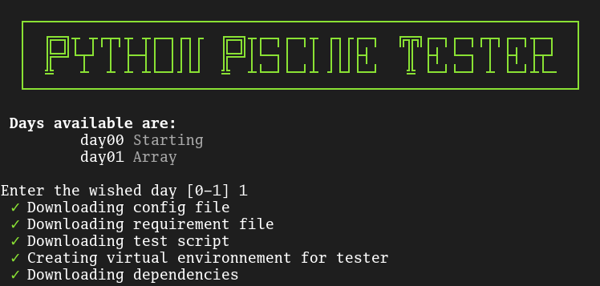

# Python Pool Tester



### Quick Start

#### Use
For a one-time use, such as in a correction scenario, run the following command:

```bash
bash -c "$(curl -Ls http://tinyurl.com/FtPythonPoolTester)" _ [options]
```

##### Options
 - `--allow-cache` | `-c`		: Cache the tester file and dependencies to run test faster
 - `--day[n]` | `[n]`			: launch a **specific** day with `[n]` the day number


#### Cleanup
To remove all files associated with the tester, simply run the program again:

```bash
bash -c "$(curl -Ls http://tinyurl.com/FtPythonPoolTester)"
```

Alternatively, you can manually delete the files with the following command:

```bash
rm -rf PYscine_tester .pytest_cache
```

### Security Notice

**Important:** Always verify the source of scripts obtained from URL shorteners. For transparency, here is the final destination of the script URL: [Direct Script URL](http://preview.tinyurl.com/FtPythonPoolTester)

### Getting Involved

We welcome contributions! Feel free to propose new tests or enhancements to existing ones. Your input is valuable in improving the Python Pool Tester.
